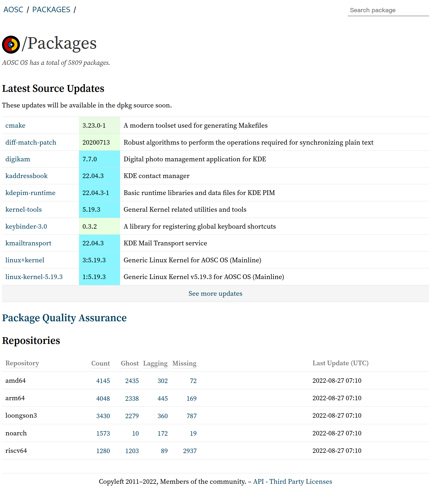

# 背景

本项目是开源之夏课题 [AOSC 的软件包信息站重实现](https://summer-ospp.ac.cn/#/org/prodetail/22f3e0080) 的具体实现。

本项目是 [旧的软件包站](https://github.com/AOSC-Dev/packages-site) 的 Rust 重实现，其目标是可以正确地解析所有 AOSC OS 软件包的元数据并展示出来。

# 功能

- 仅依赖 `abbs.db` 和 `p-vender-rs` 生成的数据库，配置更简单
- 相较于原实现，添加了更多功能
    - 展示解析错误的软件包具体的错误信息
    - 展示存在测试分支的软件包及其版本
    - 支持从`SRCS=` 的语法中解析出上游 URL
    - 更多彩的主页，主页中 `Latest Source Updates` 下软件包的版本号被染色，便于判断软件包状态
    - 将主页中的 `Package Quality Assurance` 独立出来，变成大标题
- 部分功能被移除，因为其已不再使用或者已不符合当前的需求
    - 移除了侦测上游版本更新的功能，移除对 `piss.db` 的依赖
    - 移除了主页上 `Source Tree` 的显示
    - 移除了 `/query` API
- 更安全，移除了原实现中可直接调用 SQL 的 API，数据库默认不可变， 无 unwrap() 语句

# 编译

```bash
# install Rust toolchain
curl --proto '=https' --tlsv1.2 -sSf https://sh.rustup.rs | sh

# install dependencies
sudo apt install clang make pkg-config

# build
cargo build --release
```

# 运行

你需要先去参照 `abbs-meta` 生成 `abbs.db` ，或者你也可以从 [packages-site](http://packages.aosc.io/data/abbs.db) 上直接下载，将其放在 data 目录中。如果你想运行 `Package Quality Assurance` 相关的页面，你需要参照 [`p-vender-rs`](http://github.com/AOSC-Dev/p-vector-rs) 生成对应的 PostgreSQL 数据库。

```bash
# run packages-site
cargo run --release
```

# API

Add `?type=json` to (almost) every endpoints, or send the `X-Requested-With: XMLHttpRequest` HTTP header, then you will get an json response.

Add `?type=tsv` to endpoints with a large table, then you will get a Tab-separated Values table, suitable for spreadsheet applications or unix tools.

On listings that have multiple pages, use `?page=n` to get each page.Use `?page=all` to avoid paging. For example, use `?page=all&type=tsv` to get a full listing in TSV.

The `/list.json` gives a full list of packages.

You can download the [abbs-meta](https://github.com/AOSC-Dev/abbs-meta) SQLite database from `/data/abbs.db`.

# 运行截图




